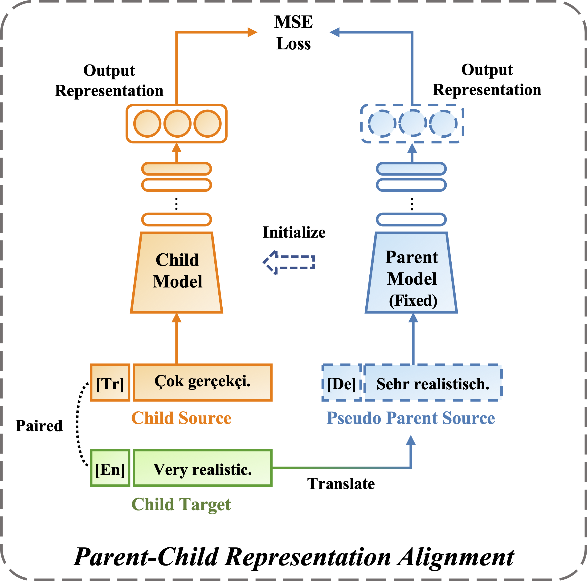

# kNN-TL
kNN-TL: k-Nearest-Neighbor Transfer Learning for Low-Resource Neural Machine Translation (ACL 2023)
## Overview

Transfer learning is an effective method to enhance low-resource NMT through the parent-child framework. kNN-TL aims to leverage the parent's knowledge throughout the entire developing process of the child model. The approach includes a parent-child representation alignment method, which ensures consistency in the output representations between the two models, and a child-aware datastore construction method that improves inference efficiency by selectively distilling the parent datastore based on relevance to the child model. 

<figure class="half">
    
    
</figure>


## Installation
```bash
cd kNN-TL
pip install --editable .
cd ..
# python>=3.7
```

## Data Preparation 
Download and preprocess the parent and child data
```bash
# download and preprocess child data
mkdir tr_en
cd tr_en
# donwload tr-en from https://drive.google.com/file/d/1B23gkfQ3O430KSGVRCqTLyjPO01A5e6L/view?usp=sharing
# raw tr-en can be downloaded from https://opus.nlpl.eu/download.php?f=SETIMES/v2/moses/en-tr.txt.zip
cd ..
fairseq-preprocess -s tr -t en --trainpref tr_en/pack_clean/train --validpref tr_en/pack_clean/valid --testpref tr_en/pack_clean/test --srcdict tr_en/dict.tr.txt --tgtdict dict.en.txt --workers 10 --destdir ${BIN_CHILD_DATA}
# download and preprocess teacher data
mkdir de_en
cd de_en
#donwload de-en from https://drive.google.com/file/d/15CXWVj0NIMjDjxEfPCw2WktoYADUuX8O/view?usp=sharing
cd ..
fairseq-preprocess -s de -t en --trainpref de_en/pack_clean/train --validpref de_en/pack_clean/valid --testpref de_en/pack_clean/test --joined-dictionary --destdir ${BIN_PARENT_DATA} --workers 10
```

## Training

#### Parent Models
```bash
cd train-scripts
BIN_PARENT_DATA=${BIN_PARENT_DATA} # path of binarized parent data
## train for de-en 
bash train_parent.sh de en $BIN_PARENT_DATA
## train for en-de (reversed parent model)
bash train_parent.sh en de $BIN_PARENT_DATA
```
#### Pseudo Parent Data Construction
For each instance in child train data (Tr-En), use the reversed parent model to back-translate the target sentence (En) into the source sentence (De).
```bash
CHILD_EN=${CHILD_EN} # target sentences 
REVERSED_PARENT_CHECKPOINT=${REVERSED_PARENT_CHECKPOINT} ## path of trained reversed parent model checkpoint
AUX_SRC_BIN=${AUX_SRC_BIN} # auxiliary source
#gen synthetic de-en for tr-en
bash gen.sh $CHILD_EN $BIN_TEACHER_DATA $REVERSED_TEACHER_CHECKPOINT $AUX_SRC_BIN
```
#### Child model
Exploit Token Matching (TM) for initialization, then train the child model with parent-child representation alignment.
```bash

BIN_CHILD_DATA=${BIN_CHILD_DATA} # path of child data
BIN_PARENT_DATA=${BIN_PARENT_DATA} # path of parent data
INIT_CHECKPOINT=${INIT_CHECKPOINT} # path of initialized child checkpoint
PARENT_CHECKPOINT=${PARENT_CHECKPOINT} # path of parent checkpoint
# Token matching
python ../kNN-TL/preprocessing_scripts/TM.py --checkpoint $PARENT_CHECKPOINT --output $INIT_CHECKPOINT --parent-dict $BIN_PARENT_DATA/dict.de.txt --child-dict $BIN_CHILD_DATA/dict.tr.txt --switch-dict src
# train child model for kNN-TL
bash kNN-TL.sh $AUX_SRC_BIN-bin $PARENT_CHECKPOINT $BIN_PARENT_DATA $BIN_CHILD_DATA $INIT_CHECKPOINT
```
## Inference
#### Origin Parent Datastore Building
Use the parent model and parent data to build the origi parent datastore.
```bash
PARENT_DATASTORE=${PARENT_DATASTORE} # The path to save the parent datastore
bash build_parent_datastore.sh $PARENT_CHECKPOINT $BIN_PARENT_DATA $PARENT_DATASTORE
```
#### Child-Aware Parent Datastore Building
Use the parent model to inference on the pseudo parent data, with kNN retrieval on the origin parent datastore. Subsets of datastore indexes will be generated in `PSEUDO_PARENT_DATA`.
```bash
# Combine the child target (En) and its pseudo parent source (De) generated in Pseudo Parent Data Construction as ‘PSEUDO_PARENT_DATA’
PSEUDO_PARENT_DATA=${PSEUDO_PARENT_DATA}
bash inference_pseudo_parent.sh $PARENT_CHECKPOINT $PSEUDO_PARENT_DATA $PARENT_DATASTORE
```
#### Parent-Enhanced Model Prediction
Tuning different subsets and parameters on the Valid Set, then selecting the best combination of parameters to evaluate performance on the Test Set. More parameters can be modified in the script.
```bash
GEN_SUBSET=${GEN_SUBSET} # [valid,test]
SUBSET_PATH=${SUBSET_PATH} # Path of the subset in the `PSEUDO_PARENT_DATA`
bash inference_child.sh $CHILD_MODEL $CHILD_DATA $GEN_SUBSET $DATA_STORE $SUBSET_PATH $RESULT_PATH 
```
